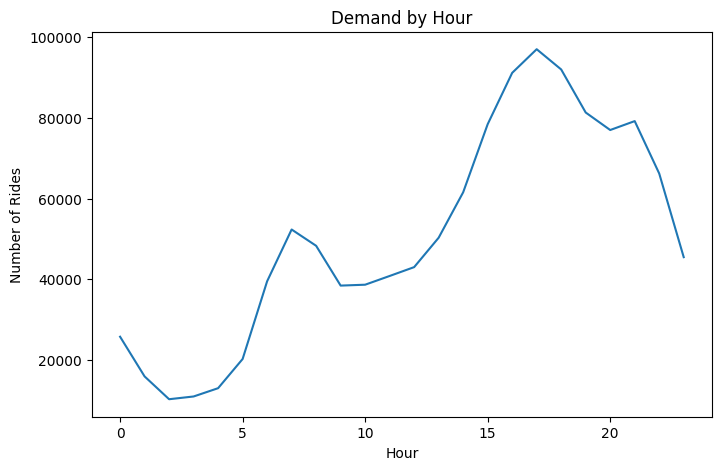
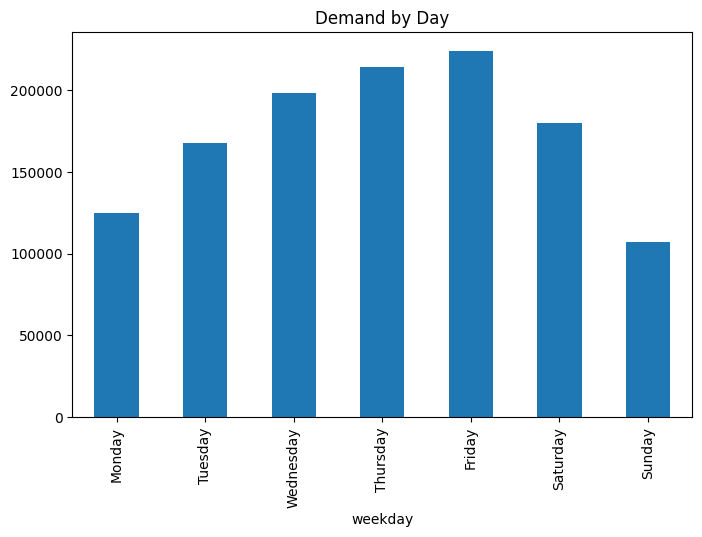
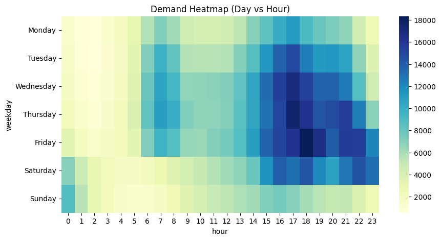
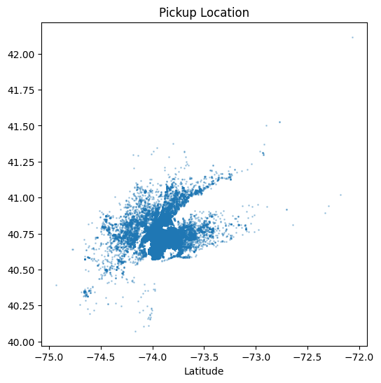

# Ride-Hailing Demand Optimization Analysis (Uber NYC)

## Problem Statement
Ride-hailing platforms like Uber face a critical operational challenge:
> How can driver supply be dynamically aligned with demand to reduce rider wait times and maximize revenue?

This project analyzes ride patterns across time and location to identify high-impact opportunities for driver allocation, surge pricing, and operational efficiency.

## Dataset
- Source: Uber Pickups in New York City (2014)
- Scope: April-May 2014 (~1.2M rides)
- Features:
    - Timestamp (Date/Time)
    - Latitude & Longitude
    - Dispatch Base

## Approach
**1. Data Preparation**
- Merged multiple datasets
- Converted timestamps into structured features:
    - Hour
    - Day
    - Weekday
- Cleaned and validated ~1.2M records

**2. Demand Analysis**
- Hourly demand trends
- Day-wise demand comparison
- Heatmap (Day vs Hour)
- Peak demand identification

**3. Spatial Analysis**
- Pickup density visualization (Lat/Lon)
- Peak vs non-peak distribution
- Zone approximation using coordinate binning

**4. Demand Segmentation**
- Identified top demand windows (day + hour combinations)
- Distinguished between:
    - Commute-driven demand
    - Leisure-driven demand

## Key Insights
**1. Bimodal Demand Pattern (Commute Behavior)**
- Demand peaks: 
    - Morning: 6-9 AM 
    - Evening: 4-8 PM
- Evening peak (~5 PM) is nearly 2x higher than morning peak

    Indicates stronger post-work mobility (errands, social, flexible schedules)


**2. Friday Demand Spike (High Revenue Opportunity)**
- Friday shows extended peak from 5PM to late night
- Demand spills into early Saturday hours

    Represents a hybrid demand:
- Work commute + Social activity


**3. Weekend Demand Shift (Unstructured Patterns)**
- Lower overall volumne than weekdays
- Higher late-night and early-morning activity

    Demand becomes event-driven rather than schedule-driven


**4. Spatial Demand Concentration**
- Strong clustering in central NYC (Manhattan region)
- Clear outward dispersion in evening hours

    Indicates directional flow: 
- Morning → toward business districts
- Evening → toward residential/leisure zones


**5. High-Impact Demand Windows**

    Top demand periods identified:
- Weekday evenings (4-8 PM)
- Friday nights (extended peak)
- Weekend late nights (12-3 AM)

    These windows drive disproportionate ride volume and revenue

## Key Insights
**Demand by Hour**


**Demand by Day**


**Demand by Heatmap (Day vs Hour)**


**Pickup Location Density**


## Business Recommendations
**1. Peak Hour Optimization**
- Pre-position drivers 45-60 minutes before peak hours
- Focus on weekday commute windows

**2. Friday Surge Strategy**
- Extend surge pricing window:
    - 5 PM → 1 AM
- Increase late-night driver incentives

**3. Zone-Based Driver Allocation**
- Concentrate drivers in high-density zones during mornings
- Dynamically redistribute outward in evenings

**4. Weekend Night Operations**
- Focus on nightlife zones
- Ensure driver availability during:
    - 12 AM - 3 AM

**5. Data-Driven Dispatch Strategy**
- Use demand patterns to build predictive allocation models
- Transition from reactive → proactive driver positioning

## If I Were Uber (Strategy View)
This analysis highlights that ride demand is predictable, segmentable, and monetizable.

A production-ready system would:
- Forecast demand by hour + zone
- Dynamically reposition drivers
- Optimize surge pricing windows
- Improve rider wait times while increasing revenue

## Tools & Technologies
- Python (Pandas, Matplotlib, Seaborn)
- Jupyter Notebook
- Git & GitHub

## Project Structure
```
ride-demand-analysis/ 
│ 
├── data/ 
│ ├── raw/ 
│ ├── cleaned/ 
│ 
├── notebooks/ 
│ └── eda.ipynb 
│ 
├── visuals/ 
├── src/ 
├── README.md
```

## Future Enhancements
- Demand forecasting using ML models
- Real-time driver allocation simulation
- Interactive dashboard (Streamlit / Power BI)
- Integration with external data (weather, events)

## Outcome
This project demonstrates the ability to: 
- Clean and transform large-scale real-world data 
- Extract actionable business insights
- Translate analysis into strategic decisions

This is not just analysis - it is a decision-making framework for ride-hailing optimization.
